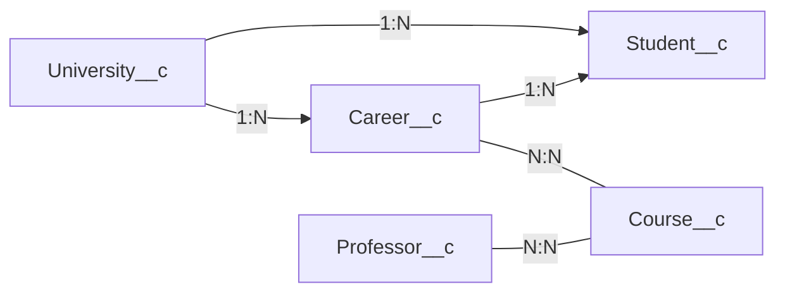

# ADR-001 — Diseño conceptual inicial de UniHub

| Atributo | Valor |
|---|---|
| Proyecto | UniHub |
| Fecha | 2026-09-15 |
| Etapa | Semana 1 — Salesforce Platform & Data Model |
| Estado | Superseded |
| Superseded by | ADR-002 — UniHub Data Model v2
| Ubicación prevista | `docs/decisions/ADR-001-unihub-diseno-conceptual.md` |

## 1. Contexto y alcance

UniHub es el proyecto de aprendizaje que utilizaremos para desarrollar una aplicación de gestión universitaria en Salesforce.

Esta decisión documenta las entidades, los atributos y las relaciones acordados durante el ejercicio de modelado. Representa la primera versión del diseño, no una solución completa para todos los procesos de una universidad.

Se decidió distinguir entre **carrera o programa académico** (`Career`) y **asignatura** (`Course`). Por ejemplo, Ingeniería Informática es una carrera; Matemáticas I es una asignatura que puede formar parte de varias carreras.

El modelo describe la situación académica actual del estudiante. La gestión de históricos, cambios de carrera y períodos académicos queda fuera de esta primera versión.

> Este documento no decide todavía los tipos de campo, Lookup frente a Master-Detail ni la implementación concreta de las relaciones muchos-a-muchos.

## 2. Decisión

Adoptar cinco entidades principales, previstas como objetos personalizados en Salesforce:

```text
University__c
Student__c
Career__c
Course__c
Professor__c
```

Los atributos que se muestran a continuación son **nombres conceptuales**. No constituyen todavía una especificación de nombres de API, tipos de campo o archivos de metadata.

### 2.1. University — Universidad

**Objeto previsto:** `University__c`

Representa una universidad gestionada por UniHub.

| Atributo | Significado |
|---|---|
| `name` | Nombre de la universidad |
| `address` | Dirección de la universidad |

Una universidad puede tener múltiples estudiantes y ofrecer múltiples carreras.

### 2.2. Student — Estudiante

**Objeto previsto:** `Student__c`

Representa un estudiante y su pertenencia académica actual.

| Atributo | Significado |
|---|---|
| `name` | Nombre del estudiante |
| `gender` | Género |
| `address` | Dirección |
| `RUT` | Identificador del estudiante |
| `university` | Relación con su universidad |
| `career` | Relación con su carrera |

Para esta versión, cada estudiante pertenece a **una única universidad y una única carrera**.

La universidad de la carrera debe coincidir con la universidad del estudiante.

### 2.3. Career — Carrera o programa académico

**Objeto previsto:** `Career__c`

Representa una carrera ofrecida por una universidad.

| Atributo | Significado |
|---|---|
| `name` | Nombre de la carrera |
| `duration` | Duración de la carrera; unidad pendiente de definir |
| `university` | Relación con la universidad que la ofrece |

Ejemplos: Ingeniería Informática, Ingeniería Industrial, Telecomunicaciones, Mecánica y Minería.

Cada carrera pertenece a una universidad, puede tener muchos estudiantes y puede incluir múltiples asignaturas.

### 2.4. Course — Asignatura

**Objeto previsto:** `Course__c`

Representa una asignatura, no una carrera completa.

| Atributo | Significado |
|---|---|
| `name` | Nombre de la asignatura |
| `number_hours` | Cantidad de horas; alcance de la medida pendiente de precisar |

Ejemplos: Matemáticas I, Matemáticas II, Programación I, Bases de Datos y Física.

Una asignatura puede formar parte de varias carreras y estar asociada a varios profesores.

Las asociaciones con carreras y profesores se documentan como relaciones conceptuales. Todavía no se definen campos físicos para representarlas.

### 2.5. Professor — Profesor

**Objeto previsto:** `Professor__c`

Representa un profesor.

| Atributo | Significado |
|---|---|
| `name` | Nombre del profesor |
| `gender` | Género |
| `RUT` | Identificador del profesor |

Un profesor puede impartir varias asignaturas y una asignatura puede ser impartida por varios profesores.

No se ha definido todavía una relación directa entre profesor y universidad.

## 3. Relaciones y cardinalidades

| Relación | Cardinalidad | Interpretación |
|---|---|---|
| University → Student | 1:N | Una universidad puede tener muchos estudiantes; cada estudiante pertenece a una universidad |
| University → Career | 1:N | Una universidad puede ofrecer muchas carreras; cada carrera pertenece a una universidad |
| Career → Student | 1:N | Una carrera puede tener muchos estudiantes; cada estudiante pertenece a una carrera |
| Career ↔ Course | N:N | Una carrera puede incluir muchas asignaturas y una asignatura puede formar parte de varias carreras |
| Professor ↔ Course | N:N | Un profesor puede impartir muchas asignaturas y una asignatura puede tener varios profesores |

**Convención:** `1:N` significa uno a muchos y `N:N` significa muchos a muchos. La tabla no exige que una universidad tenga estudiantes desde el momento de su creación ni fija las participaciones mínimas de las relaciones N:N.

### Diagrama conceptual



Las etiquetas expresan cardinalidad, no un flujo de ejecución ni reglas de eliminación.

Representación equivalente en texto:

```text
University 1 ─── N Student
University 1 ─── N Career
Career     1 ─── N Student
Career     N ─── N Course
Professor  N ─── N Course
```

## 4. Reglas de negocio acordadas

| Identificador | Regla |
|---|---|
| RN-01 | Un estudiante pertenece a una sola universidad en la situación actual que representa UniHub |
| RN-02 | Un estudiante pertenece a una sola carrera en esa misma situación |
| RN-03 | Cada carrera pertenece a una universidad |
| RN-04 | La carrera del estudiante debe pertenecer a la misma universidad que el estudiante |
| RN-05 | No debe permitirse eliminar una universidad mientras tenga estudiantes asociados |

RN-04 puede expresarse conceptualmente así:

```text
Student.university = Student.career.university
```

Esto es una expresión de la regla, **no código Salesforce**.

Ejemplo válido:

```text
Estudiante A
├── university: Universidad X
└── career: Ingeniería Informática, ofrecida por Universidad X
```

Ejemplo inválido:

```text
Estudiante A
├── university: Universidad X
└── career: Ingeniería Informática, ofrecida por Universidad Y
```

La implementación y validación de estas reglas queda pendiente. Dibujar las relaciones no garantiza por sí solo su cumplimiento.

## 5. Decisiones de diseño y justificación

### 5.1. Separar Career de Course

La propuesta inicial utilizaba `Course` para representar carreras. Se decidió separar ambos conceptos porque una carrera agrupa asignaturas y una misma asignatura puede participar en varias carreras.

Ejemplo:

```text
Matemáticas I
├── Ingeniería Informática
├── Ingeniería Industrial
└── Telecomunicaciones
```

Esta decisión permite expresar la relación N:N entre carrera y asignatura.

### 5.2. No incorporar Relation_Student_Career en esta versión

Se consideró una entidad intermedia con referencias a universidad, estudiante y carrera.

Se descartó para el alcance actual porque cada estudiante tiene una sola carrera y no hemos definido atributos propios ni un historial para esa asociación. La relación directa `Career 1:N Student` resulta suficiente.

Esta decisión **no implica que una entidad intermedia sea incorrecta en todos los casos**. Podría reconsiderarse si aparecieran requisitos como historial de carreras, fechas de vigencia o información propia de la vinculación.

Tampoco significa que una entidad intermedia produzca automáticamente una relación N:N: la cardinalidad depende de las restricciones que se definan sobre ella.

### 5.3. Mantener las relaciones directas de Student con University y Career

La propuesta acordada conserva ambas relaciones:

```text
Student → University
Student → Career
Career  → University
```

Como consecuencia, la pertenencia a la universidad puede consultarse por dos caminos. Deben coincidir, por lo que RN-04 será una condición obligatoria de consistencia.

La elección del mecanismo para garantizar esa consistencia no forma parte de esta decisión conceptual.

### 5.4. Reconocer dos relaciones N:N independientes

Las relaciones muchos-a-muchos son:

```text
Career ↔ Course
Professor ↔ Course
```

Cada una representa una asociación distinta.

Describir una relación desde ambos extremos no significa crear dos relaciones independientes. Por ejemplo, “profesor imparte asignaturas” y “asignatura tiene profesores” describen la misma asociación.

La implementación en Salesforce, incluidos los posibles objetos de unión, se decidirá posteriormente.

### 5.5. Utilizar objetos personalizados como base del ejercicio

Para esta primera versión del proyecto de aprendizaje se acordaron los cinco objetos personalizados indicados.

Esta es una decisión del alcance de UniHub. No representa una regla general según la cual toda institución educativa deba modelarse únicamente con objetos personalizados ni un descarte universal de los objetos estándar.

## 6. Consecuencias y límites

El diseño distingue las entidades principales y las relaciones necesarias para iniciar UniHub sin incorporar todavía matrículas, períodos ni históricos.

La relación directa del estudiante con universidad y carrera requiere garantizar coherencia entre ambas. Asimismo, las relaciones N:N necesitan una decisión de implementación posterior: no se han definido literalmente campos llamados `course_ids`, `career_ids` o `professor_ids`.

El modelo tampoco determina todavía si una asignatura compartida entre carreras puede compartirse entre universidades distintas, ni cómo representar diferencias de contenido, horas o docentes según el período. Esos aspectos quedan abiertos; no deben asumirse resueltos por el diagrama.

## 7. Decisiones pendientes de implementación

| Área | Pendiente |
|---|---|
| Campos | Definir nombres de API, tipos, longitudes y obligatoriedad |
| Duración y horas | Precisar unidades y significado de `duration` y `number_hours` |
| Relaciones | Elegir Lookup o Master-Detail donde corresponda |
| Relaciones N:N | Definir su representación concreta y sus restricciones |
| Integridad | Implementar la coherencia universidad-carrera del estudiante y la restricción de eliminación |
| RUT | Definir formato, validación, obligatoriedad y alcance de la unicidad |
| Seguridad | Definir acceso a objetos, campos y registros |
| Ciclo de vida | Acordar el comportamiento de las demás relaciones ante cambios o eliminaciones |

Los atributos personales propuestos no implican que todos deban ser obligatorios. Esa decisión queda pendiente.

## 8. Evolución prevista: Enrollment

La inscripción de un estudiante en una asignatura queda fuera del modelo inicial.

Más adelante se analizará una entidad `Enrollment`, porque esa inscripción podría tener información propia: fecha, período académico, estado o nota final.

No se incorpora todavía al conjunto de cinco entidades ni se fija su implementación.

## 9. Resultado y siguiente etapa

Queda registrada la primera versión del modelo conceptual de UniHub.

**Este documento no acredita que los objetos hayan sido creados, desplegados o probados en Salesforce.**

La siguiente etapa será traducir el diseño conceptual al modelo específico de Salesforce, comenzando por estudiar el comportamiento de las relaciones antes de elegir su implementación.
